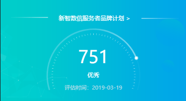

# canvas_score
# 小程序的信用分绘制，封装组件
# 使用 在使用的页面json文件中写入
   "usingComponents": {
      "canvas_score": "/components/canvas_score/canvas_score"
    }
# 在wxml文件中引入
 <canvas_score wx:if="{{orderData.scoreLevel&&orderData.creditUpdateDate}}" scoreLevel="{{orderData.scoreLevel}}" scoreUpdateTime="{{orderData.creditUpdateDate}}" totalScore="{{orderData.totalScore}}" data="{{orderData}}"></canvas_score>
 
 

